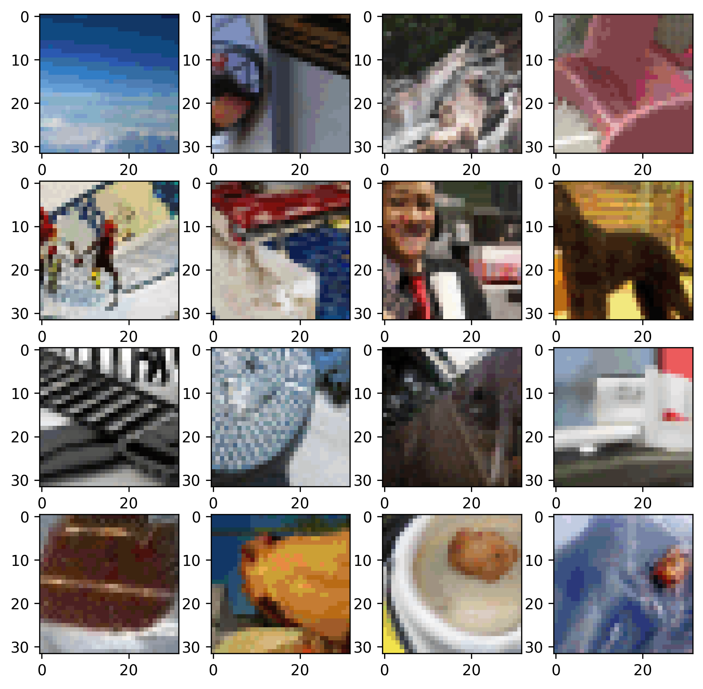

**Status:** Archive (code is provided as-is, no updates expected)

# image-gpt

Code and models from the paper ["Generative Pretraining from Pixels"](https://cdn.openai.com/papers/Generative_Pretraining_from_Pixels_V2.pdf).

Supported Platforms:

- Ubuntu 16.04

## Install

```shell
conda create --name image-gpt python=3.7.3
conda activate image-gpt

conda install numpy=1.16.3
conda install tensorflow-gpu=1.13.1

conda install imageio=2.8.0
conda install requests=2.21.0
conda install tqdm=4.46.0
pip install -r requirements.txt
```


## Run 
Run Jupyter Notebook and open `ImageGPT-Notebook.ipynb`:
```shell
jupyter notebook
```

#### Notebooks:

- `ImageGPT-Notebook.ipynb` - generate samples base on image
- `ImageGPT-Notebook-RANDOM_SAMPLE.ipynb` - generate fully random samples

## Run from console (only when you have downloaded models and color clusters)

Generate random samples:
```shell
python src/run.py --sample --n_embd {n_embd} --n_head {n_head} --n_layer {n_layer} --ckpt_path {model_dir}/model.ckpt-1000000  --color_cluster_path {color_clusters_dir}/kmeans_centers.npy --save_dir out --n_gpu 1 --n_px {size} --n_sub_batch {n_samples} --seed 0
```

Generate samples from primer (base image):
```shell
python src/run.py --sample --n_embd {n_embd} --n_head {n_head} --n_layer {n_layer} --ckpt_path {model_dir}/model.ckpt-1000000  --color_cluster_path {color_clusters_dir}/kmeans_centers.npy --save_dir out --n_gpu 1 --n_px {size} --n_sub_batch {n_samples} --seed 0 --primer {image_path}
```

Parameters:
- `n_embd`, `n_head`, `n_layer` = "l":(1536,16,48),"m":(1024,8,36),"s":(512,8,24)
- `model_dir` = directory with `model.ckpt-1000000`
- `color_clusters_dir` = directory with `kmeans_centers.npy`
- `size` = 32, 48, 64 (size in pixels, only 32 available with current models)
- `n_samples` - 1,2,4,6,8 (any int)
- `image_path` - path to image (only when generate from primer)

## Results

`ImageGPT-Notebook.ipynb` with default `test_input.jpg`


`ImageGPT-Notebook-RANDOM_SAMPLE.ipynb` with random sampling
